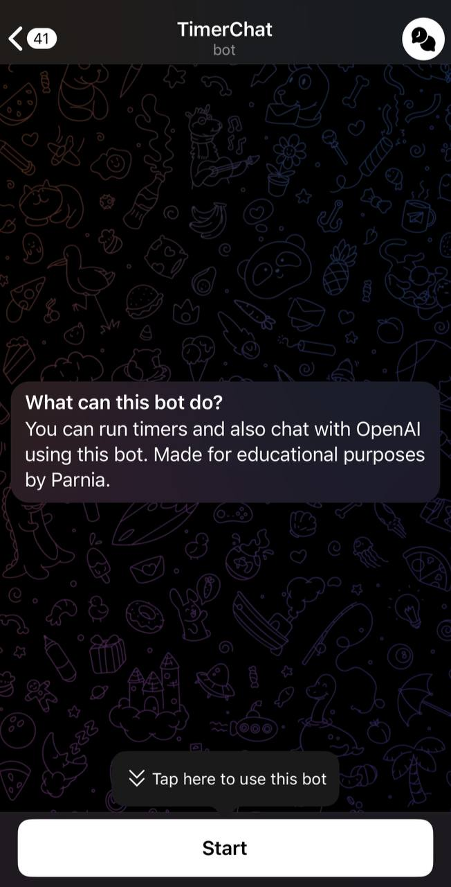
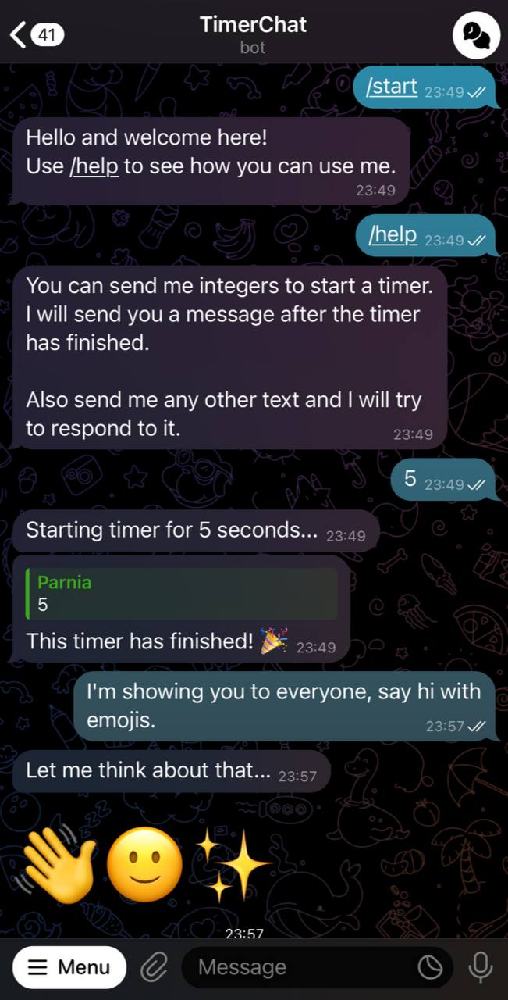

# TimerChat ⏲️💬

TimerChat is a Telegram bot designed for the [HUT](https://hut.ac.ir) OS course project!

This bot acts as a timer – just send it any number, and when the time's up, it replies to let you know the timer is finished.

TimerChat is also a proxy to OpenAI APIs. What does that mean? Well, you can send it text messages, and it connects to OpenAI to answer your questions.

> Keep in mind that this bot is created for educational purposes and is currently down. You can check out some demo pictures below.

## Demo 🚀

    
    

